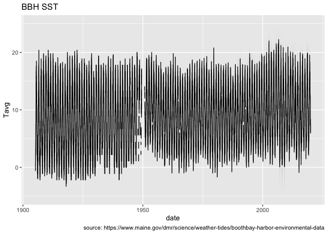
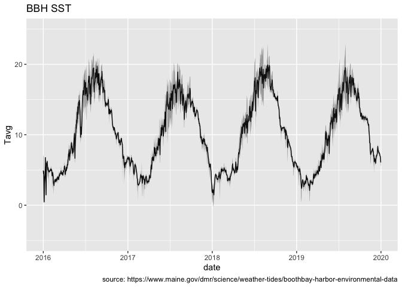
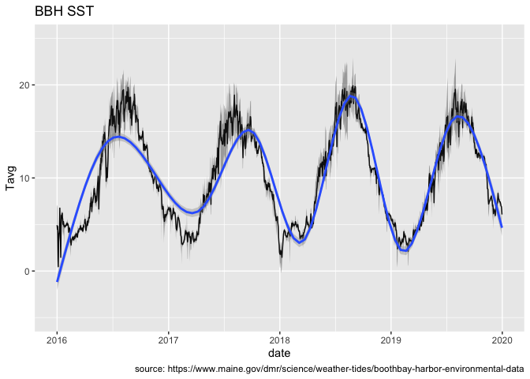

BBH-SST
================

This projects demonstrates one simple organizational path using Maine
Department of Marine Resources’ [Boothbay Harbor SST Time
Series](https://www.maine.gov/dmr/science/weather-tides/boothbay-harbor-environmental-data).

## Getting ready

### Got packages?

If you don’t have the required R packages you’ll need to install each.
You need only need to do this once, but if you upgrade R you may need or
want to update these, too.

``` r
required_packages <- c("dplyr", "readr", "ggplot2", "jsonlite", "fs", "here")
current_packages <- rownames(installed.packages())
for (package in required_packages){
  if (!(package %in% current_packages)) install.packages(package)
}
```

### Load packages and functions

For the purposes of just this `README` we’ll load the
[fs](https://CRAN.R-project.org/package=fs) package.

Otherwise, all we need to do is source the `setup.R` file.

``` r
library(fs)        # this is just for use in this README
source("setup.R")  # this is the good stuff
```

This small project organizes data, images, literature and code into
subdirectories. It’s pretty self-explanatory, but do take a look at
`setup.R` to see what is going on.

``` r
fs::dir_tree()
```

    ## .
    ## ├── R
    ## │   ├── input-output.R
    ## │   └── plot.R
    ## ├── README.Rmd
    ## ├── README.md
    ## ├── README_files
    ## │   └── figure-gfm
    ## │       ├── unnamed-chunk-6-1.png
    ## │       ├── unnamed-chunk-7-1.png
    ## │       └── unnamed-chunk-8-1.png
    ## ├── data
    ## │   ├── README.txt
    ## │   └── sst.csv
    ## ├── image
    ## ├── literature
    ## │   ├── 7-drinkwater.pdf
    ## │   └── README.txt
    ## └── setup.R

If you study `setup.R` you can see that we created three directory paths
in the global environment. You access these just like you had defined
them manually.

``` r
list.files(CODEPATH)
```

    ## [1] "input-output.R" "plot.R"

### Read the data

We created input-output functions, that `setup.R` sourced so they are
now in your global environment.

``` r
x <- read_bbh()
dplyr::glimpse(x)
```

    ## Rows: 41,902
    ## Columns: 4
    ## $ date <date> 1905-03-01, 1905-03-02, 1905-03-03, 1905-03-04, 1905-03-05, 1905…
    ## $ Tmax <dbl> NA, NA, NA, NA, NA, NA, NA, NA, NA, NA, NA, NA, NA, NA, NA, NA, N…
    ## $ Tmin <dbl> NA, NA, NA, NA, NA, NA, NA, NA, NA, NA, NA, NA, NA, NA, NA, NA, N…
    ## $ Tavg <dbl> -0.6, -0.6, -0.6, -0.6, -0.6, -0.6, -0.6, -0.6, -0.6, -0.6, -0.6,…

### Plot the data

`setup.R` also sourced a function for plotting the data.

``` r
plot_bbh(x)
```

<!-- -->

We can modify the range of time - in essence zooming into recent times.
Let’s filter out just the records from Jan 1 2016 through today.

``` r
x |>
  dplyr::filter(dplyr::between(date, as.Date("2016-01-01"), Sys.Date())) |>
  plot_bbh()
```

<!-- -->

Because `plot_bbh()` returns a plot object we can add another layer -
perhaps a smoothing line would be nice?

``` r
x |>
  dplyr::filter(dplyr::between(date, as.Date("2016-01-01"), Sys.Date())) |>
  plot_bbh() +
  ggplot2::geom_smooth(level = 0.99)
```

<!-- -->
